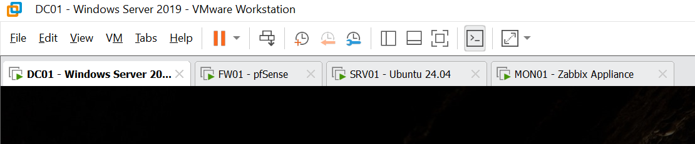
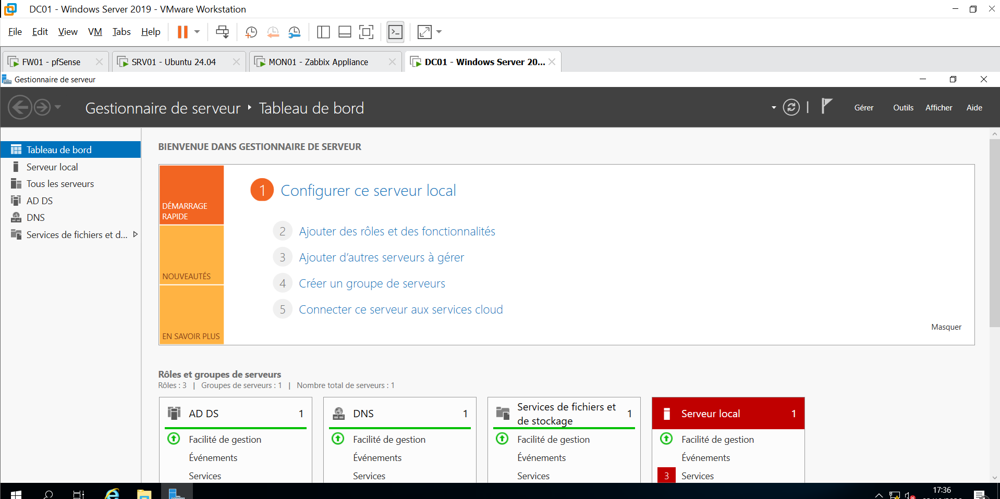
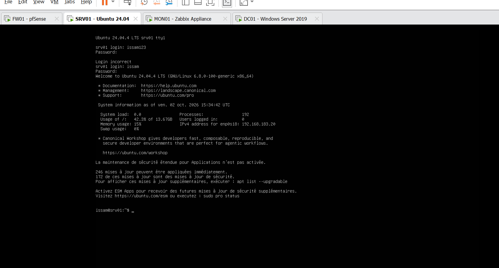
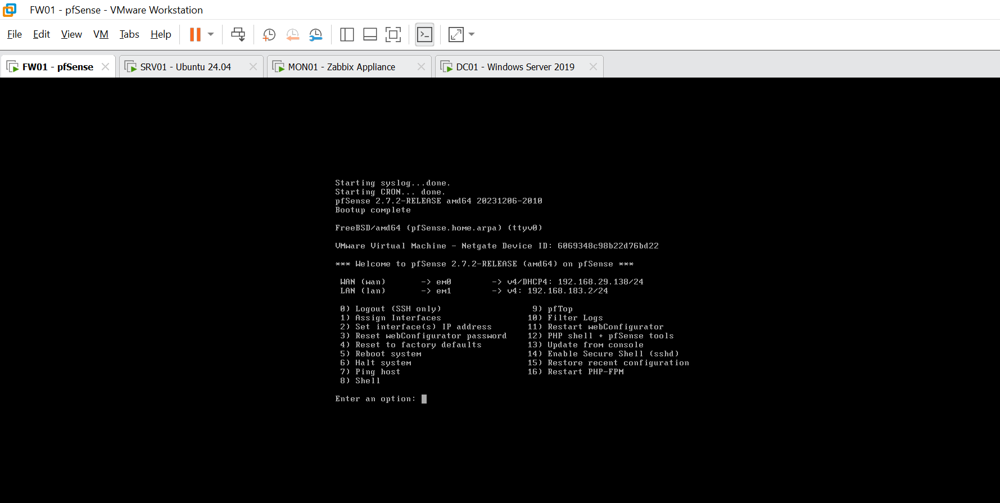
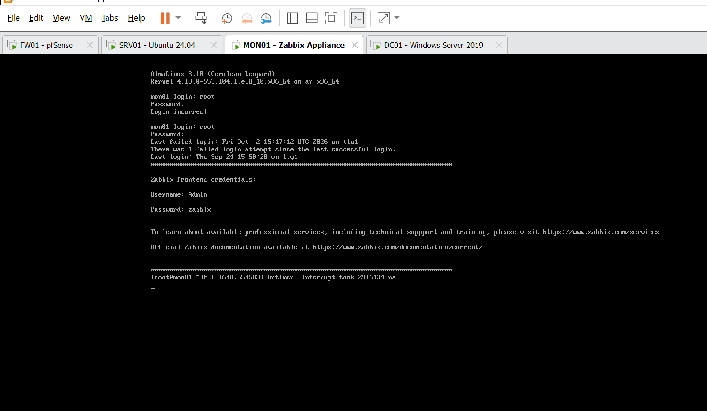

# homelab-esi
VMware Workstation sandbox — Windows Server 2019 AD (lab.local), pfSense gateway, Ubuntu 24.04 server, Zabbix 7 supervision.

  

<h1 align="center">Laboratoire d'infrastructure — Virtualisation & Services</h1>

  
  
  
  

## 🎯 Objectif du projet

Mettre en place, **de zéro**, une infrastructure complète et fonctionnelle dans des
machines virtuelles (VMware Workstation), sur le modèle d'un petit réseau d'entreprise :

- un **contrôleur de domaine** avec identifiants unifiés (AD + DNS),
- une **passerelle pare-feu** protégeant le réseau interne,
- un **serveur Linux** intégré au domaine pour les services applicatifs,
- une **plateforme de supervision** surveillant l'ensemble de l'infrastructure.

L'intérêt pédagogique : comprendre, installer et dépanner **chaque brique
séparément**, puis les faire **dialoguer entre elles** (authentification centralisée,
résolution DNS, supervision), comme dans un vrai SI.

## 🗂️ Architecture

| VM    | Rôle                              | IP interne      | Services principaux |
|-------|-----------------------------------|-----------------|---------------------|
| FW01  | Passerelle / pare-feu (pfSense)   | 192.168.183.2   | NAT, routage interne |
| DC01  | Contrôleur de domaine `lab.local` | 192.168.183.10  | Active Directory, DNS |
| SRV01 | Serveur GNU/Linux (Ubuntu 24.04)  | 192.168.183.20  | Services applicatifs (AD join) |
| MON01 | Supervision (Zabbix 7)            | 192.168.183.30  | Zabbix server + Web UI |

<table>
  <tr>
    <td></td>
    <td></td>
  </tr>
  <tr>
    <td></td>
    <td></td>
  </tr>
</table>

## 🌐 Plan réseau

- **Réseau interne (lab)** : `192.168.183.0/24` — vmnet1 (host-onlyg), passerelle `192.168.183.2`
- **Accès externe** : vmnet8 (NAT) `192.168.29.x` — WAN du pare-feu pfSense
- **DNS** : DC01 (`192.168.183.10`) — domaine `lab.local`

| Machine | IP interne | FQDN             |
|---------|-----------|------------------|
| FW01    | .2        | fw01.lab.local   |
| DC01    | .10       | dc01.lab.local   |
| SRV01   | .20       | srv01.lab.local  |
| MON01   | .30       | mon01.lab.local  |

## 🏗️ Ce qui a été réalisé

- **FW01** : pfSense opérationnel (WAN NAT + réseau interne, console d'administration).
- **DC01** : forêt Active Directory `lab.local` créée, rôle DNS installé, OU `ITDept`
  et comptes utilisateurs (`issam`, `alae`) provisionnés.
- **SRV01** : Ubuntu 24.04 en IP statique, **joint au domaine** (realmd/sssd),
  connexions AD fonctionnelles avec création automatique du dossier personnel.
- **MON01** : appliance Zabbix en IP statique, console Web déployée, **également
  joint au domaine**.
- **Supervision** : agents Zabbix installés sur **DC01** et **SRV01**, hôtes
  créés, disponibilité **verte** (mesures collectées en continu).

## 🧭 Prochaines étapes

- [ ] Résoudre l'authentification AD sur MON01 (SSSD — problème d'encryption kerberos)
- [ ] Authentification Zabbix via le domaine AD (comptes `issam`, `alae`)
- [ ] Serveur de messagerie dans le domaine (objectif principal du laboratoire)
- [ ] Fichier `/etc/hosts` / reverse DNS cohérents
- [ ] Sauvegardes & état stable des machines (snapshot)
- [ ] Documentation des incidents rencontrés (journal technique)

## 🔐 Sécurité

Ce dépôt est **public** : les identifiants et mots de passe du laboratoire sont
volontairement absents. Inventaire des comptes et accès conservé **en local**
(non versionné). Le domaine AD est `lab.local`.

## Journal technique

| Date | Action | Problème rencontré | Solution |
|------|--------|--------------------|----------|
| _(à remplir au fil des étapes — ex : bugs SATA, reset GRUB, encodages Kerberos…)_ |

---
*Laboratoire pédagogique virtuel — VMware Workstation Pro 17.6.4.*
